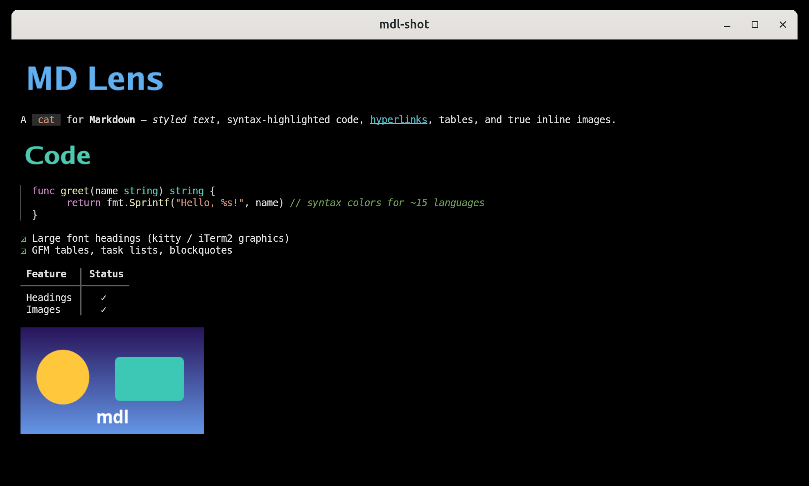

# MD Lens

**MD Lens** (`mdl`) is a rich terminal Markdown viewer. Prints a `.md` file to your terminal with ANSI styling, syntax-highlighted code, **inline images**, and **large font headings**



*`mdl docs/demo.md` running in [kitty](https://sw.kovidgoyal.net/kitty/), where headings render as real font images and pictures display inline.*

## Install

Download a prebuilt binary from the [latest GitHub release](https://github.com/benelog/md-lens/releases/latest) — no dependencies, single static binary.

**Linux (x86_64)**

```bash
curl -L -o mdl https://github.com/benelog/md-lens/releases/latest/download/mdl-linux-amd64
chmod +x mdl
sudo install mdl /usr/local/bin/   # or move it anywhere on your PATH
```

**Linux (arm64)** — same as above with `mdl-linux-arm64`.

**Windows (x86_64)** — PowerShell:

```powershell
Invoke-WebRequest https://github.com/benelog/md-lens/releases/latest/download/mdl-windows-amd64.exe -OutFile mdl.exe
```

## Run

```bash
mdl test.md
# reads stdin when no file is given:
cat test.md | mdl
```

## Features

- **Headings** rendered as true large fonts: the text is rasterized with an embedded
  sans-serif font and shown through the terminal's image protocol; falls back to bold +
  underline on plain terminals.
- **Inline images** via the kitty graphics protocol, the iTerm2 inline protocol, or a
  truecolor Unicode half-block (`▀`) fallback — auto-detected, with graceful degradation.
- **Syntax highlighting** for ~15 popular languages (Java, Python, JS/TS, Rust, Go, C/C++,
  JSON, YAML, Bash, SQL, HTML/XML).
- Bold / italic / strikethrough / inline code, nested lists, GFM **task lists**, blockquotes,
  **tables**, thematic breaks, and clickable **OSC 8 hyperlinks**.
- Terminal-aware: truecolor → 256 → 16 → no-color, and clean plain text when piped.

## Options

```
-w, --width N             force output width in columns
    --no-color            disable ANSI color
    --no-images           do not render images
    --no-heading-images   render headings as styled text, not font images
    --force-kitty         force the kitty graphics protocol
    --force-iterm         force the iTerm2 inline image protocol
    --force-halfblock     force the unicode half-block image fallback
-p, --plain               plain text, no styling
    --caps                show detected terminal capabilities and exit
-h, --help                show help
-V, --version             show version
```

## Terminal support

Run `mdl --caps` to see what your terminal supports. mdl auto-detects the right path and degrades
gracefully — no flags needed.

| Terminal                                            | Image protocol      | Headings                      | Inline images       |
| --------------------------------------------------- | ------------------- | ----------------------------- | ------------------- |
| kitty, WezTerm, Ghostty, recent Konsole             | kitty graphics      | large font images             | crisp pixel images  |
| iTerm2                                              | iTerm2 inline       | large font images             | crisp pixel images  |
| Terminator & most VTE/GNOME terminals (truecolor/256) | none (auto fallback) | styled text (color + decoration) | half-block (`▀`)    |
| dumb terminal, piped output, or `--no-color`        | none                | styled text                   | alt text            |

> **Don't** pass `--force-kitty` on a terminal that doesn't support it — the escape codes would
> print as garbage. Let mdl auto-detect instead.
